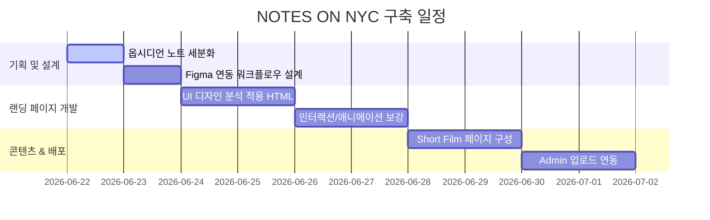

# 01_ROADMAP

이 문서는 "NOTES ON NYC" 웹사이트 구축 프로젝트의 단계별 마일스톤과 작업 추진 일정을 관리하는 로드맵 파일입니다.

## 📅 프로젝트 마일스톤

## 🛠️ 주요 도구 & 통합 계획
1.  **디자인 툴**: Figma
2.  **코딩 환경**: Vanilla HTML, Vanilla CSS, JS (Micro Interaction)
3.  **동기화 워크플로우**: Anima Plugin 또는 Builder.io를 활용하여 Figma의 시각적 요소와 HTML 코드베이스 간 상호 동기화(양방향).

---
*Next: [02_DESIGN_ANALYSIS](file:///Users/jeikosoh/Work%20Station/002_NOTES_ON/NOTES_ON_WEB/02_DESIGN_ANALYSIS.md)*
